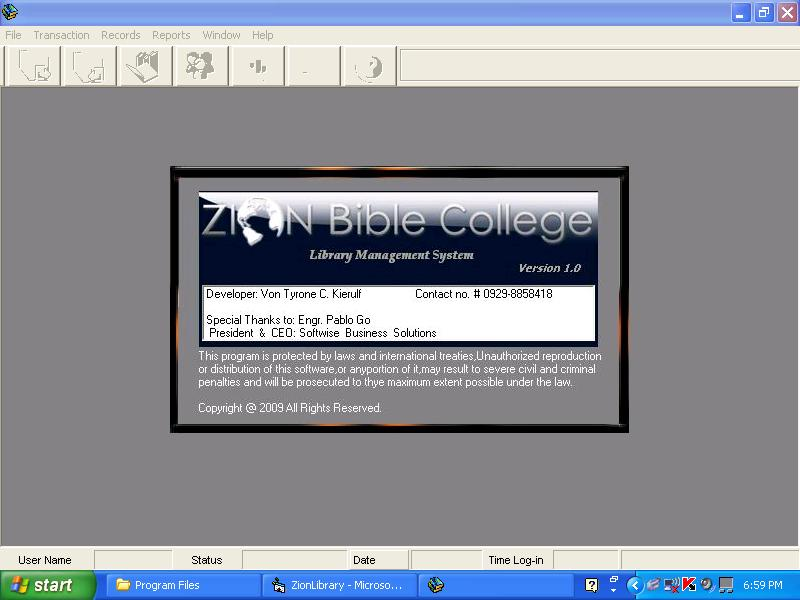



## Zion Library System

### Description

Zion Library System is a complete application that you may learn from,use

or distribute. you can do anything that you want with the submission.

its an excellent graphical user interface library managment system to

track books in the library,library Members and library borrowings.

I designed three user access levels to provide retrictions and limitations to other users

other than the administrator.

you will notice as you use it that the sofware is almost a commercial

software which has so many features that you can use or try to learn from

as you explore its code.

you may replace the graphics flash files according to your liking.

some of the original flash,wav,bitmaps were replaced to trim down its

file size.

do not forget to place the usermanual(pdf) in windows directory.

some of the modules were borrowed from some programmers in planet source

code.

thanks a lot to fellow programmers I learned a lot from them

specially to the developer of hme library where i patterned my system design after.

the system is not free of bugs as it it still in its development process

and not yet finished...

Please dont forget to vote and leave your comments.

username: jaguar7

password: mlev

Software Developer: Von Tyronce C. Kierulf
 
### More Info
 

             |
---                |---
**Submitted On**   |2009-11-18 23:52:12
**By**             |[Von Tyrone C\. Kierulf](https://github.com/Planet-Source-Code/PSCIndex/blob/master/ByAuthor/von-tyrone-c-kierulf.md)
**Level**          |Intermediate
**User Rating**    |4.4 (22 globes from 5 users)
**Compatibility**  |VB 6\.0
**Category**       |[Databases/ Data Access/ DAO/ ADO](https://github.com/Planet-Source-Code/PSCIndex/blob/master/ByCategory/databases-data-access-dao-ado__1-6.md)
**World**          |[Visual Basic](https://github.com/Planet-Source-Code/PSCIndex/blob/master/ByWorld/visual-basic.md)
**Archive File**   |[Zion\_Libra21682011192009\.zip](https://github.com/Planet-Source-Code/von-tyrone-c-kierulf-zion-library-system__1-72658/archive/master.zip)

